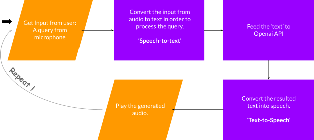

Jatayu Season3

# **Oral Odyssey** : A Speech Recognition and Query Answering App

#

# Introduction

Our app aims to revolutionize the way users interact with their devices by allowing them to communicate with them through natural language. Using state-of-the-art speech recognition technology, the app converts spoken queries into text and sends them to the OpenAI API for processing. The API then returns the results, which are then converted back into speech using a npm module. This allows users to have a seamless, conversation-like experience with their device, making it easier and more intuitive to access information and perform tasks. Whether you're looking for the latest news, weather, or just want to have a casual conversation, our app has you covered.

## Workflow

### Speech to text

The '[react-speech-recognition](https://www.npmjs.com/package/react-speech-recognition)' npm module allows our app to easily convert spoken words into text. This module is based on the Web Speech API, which is supported by modern browsers and provides high-quality speech recognition. By using 'react-speech-recognition', we can easily integrate this functionality into our app, allowing users to simply speak their queries and have them automatically converted into text for processing. This makes it faster and easier for users to get the information they need, and eliminates the need for typing or manually entering text.

useSpeechRecognition is a React hook that gives a component access to a transcript of speech picked up from the user's microphone.

SpeechRecognition manages the global state of the Web Speech API, exposing functions to turn the microphone on and off.

###

### Processing the query using Openai

Using the [OpenA](https://openai.com/api/)I API allows our app to provide more natural and human-like responses to user queries. OpenAI is a leading provider of artificial intelligence technologies, and their API is trained on a vast dataset of human language, allowing it to understand and respond to a wide range of inputs in a way that feels more like a conversation with a real person. This makes it easier for users to get the information they need and makes the overall experience more enjoyable.

### Text to speech

The '[react-speech-kit](https://www.npmjs.com/package/react-speech-kit)' npm module allows our app to convert text into speech in a natural-sounding voice. This module uses the Web Speech API to synthesize spoken words from written text, allowing users to hear the results of their queries rather than just reading them. By using 'react-speech-kit', we can easily add this functionality to our app, enhancing the user experience and making it more convenient for users to access information on the go.

## Development stack (only rough idea)

- HTML, CSS, JavaScript - Frontend
- OpenAI API
- NPM modules
  - react-speech-recognition
  - react-speech-kit
- Github - for version control and to collaborate

